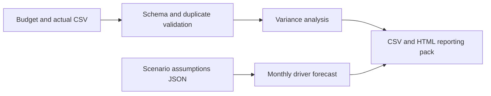

# FP&A Toolkit

An independent consulting portfolio project by **Lavonte Jones**. Turn a monthly budget/actual file into a variance review and a 12-month driver-based cash outlook. The fictional sample demonstrates a repeatable management reporting deliverable with transparent assumptions.

## Run the demo
Python 3.11 or newer; standard library only. No installation, credentials, or environment variables are required.
```sh
python fpa.py
python -m unittest discover -s tests -v
```
Open `outputs/report.html` in a browser. Outputs include `variance.csv` and `forecast.csv`. A generated [sample report](docs/sample-report.html) is committed for review; [walkthrough](docs/DEMO.md) explains the results.

## Bring your own local inputs
```sh
python fpa.py --actuals private/actuals.csv --assumptions private/assumptions.json --output outputs
```
Keep real client material in an ignored folder outside public Git history. Input columns are exactly `month,account,kind,budget,actual`. Month uses YYYY-MM; kind is `revenue` or `expense`. One row per month/account is required. Amounts use decimal currency arithmetic with half-up cent rounding; non-finite values and invalid rates are rejected.

## Architecture


## Interpreting the report
Variance = actual − budget. Favorable variance reverses the sign for expenses, so positive always means better than budget. Percentage variance is absent for zero budgets. Forecast revenue grows beginning in month two; variable costs scale with revenue, fixed costs stay constant, and cash accumulates operating surpluses or deficits. Negative balances remain visible as funding gaps.

## Scope and limitations
Synthetic USD examples only. This is a management-planning model, not audited accounting or investment advice. It assumes same-month collection and payment and excludes receivables/payables, taxes, financing, capex, and balance-sheet reconciliation. Growth rates are illustrative assumptions, not predictions. Validate accounting treatment, source totals, timing, and assumptions before any real engagement. No JONESYS branding or assets are included.

## Validation and license
Tests cover variance signs, zero budgets, rounding, non-finite values, forecast reconciliation, cash gaps, invalid assumptions, duplicate rows, and report generation. CI repeats validation. See [audit notes](docs/AUDIT.md). MIT license; sample fixtures were authored for this repository.
