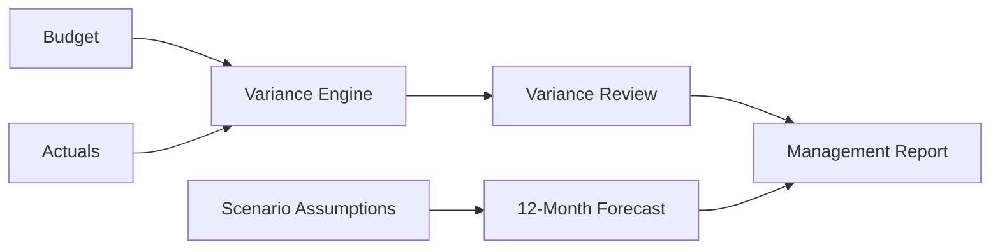

## Deliverables

| Output         | Purpose                    |
| -------------- | -------------------------- |
| `variance.csv` | Budget vs. actual analysis |
| `forecast.csv` | 12-month driver forecast   |
| `report.html`  | Management-facing report   |
| `DEMO.md`      | Walkthrough                |
